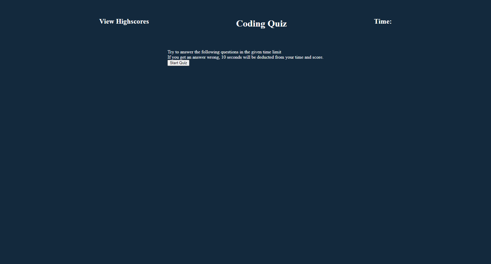
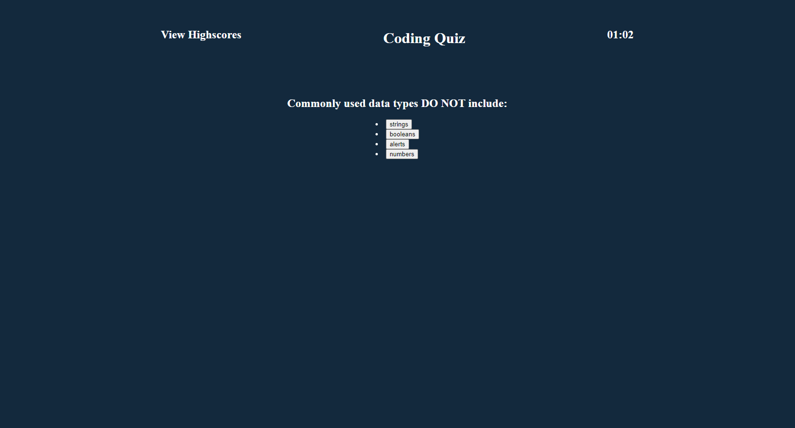

# Coding-Quiz

## Pictures of the quiz!

## Github pages 
 https://harrichas.github.io/Coding-Quiz/
 https://github.com/Harrichas/Coding-Quiz

## Langauges Used
JAVASCRIPT
CSS

## How to start the quiz
When you you click the button to start the quiz,
the screen will change to the questions and a selection of the answers.
Choose the answers of 5 questions to complete the quiz. 
If you get all wrong answers the quiz will end and you can put in your score.
The score is based on how much time is left over every wrong answer subsrtacts 10 seconds. 